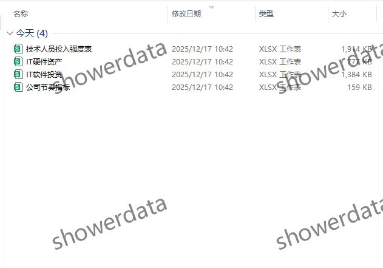
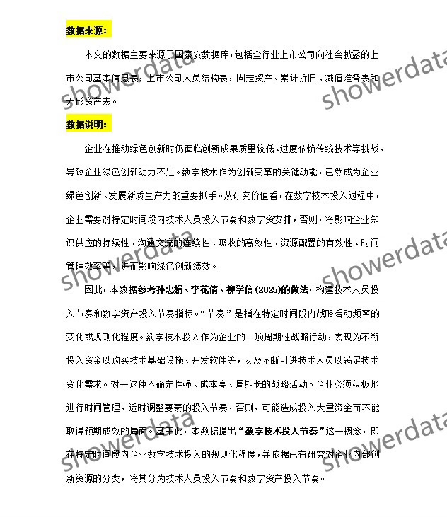
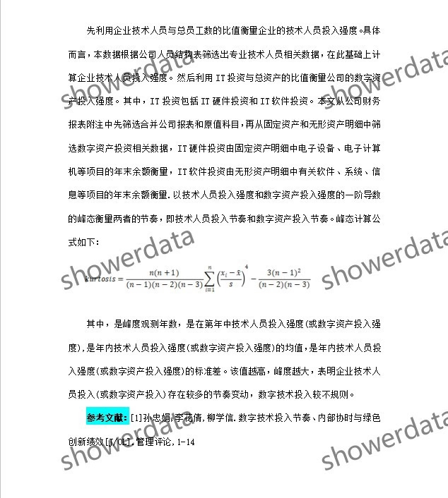
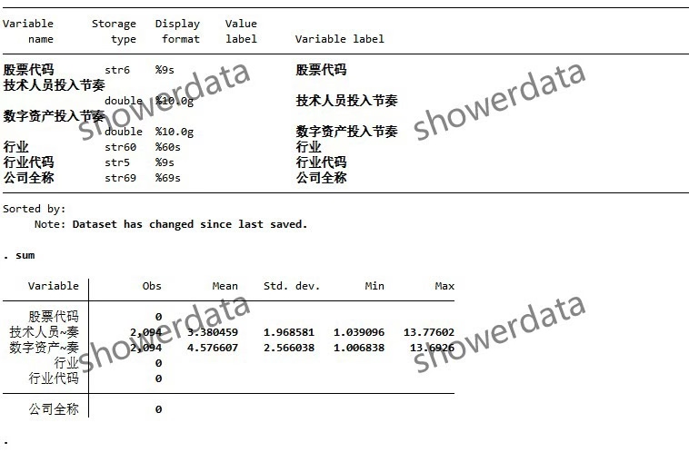
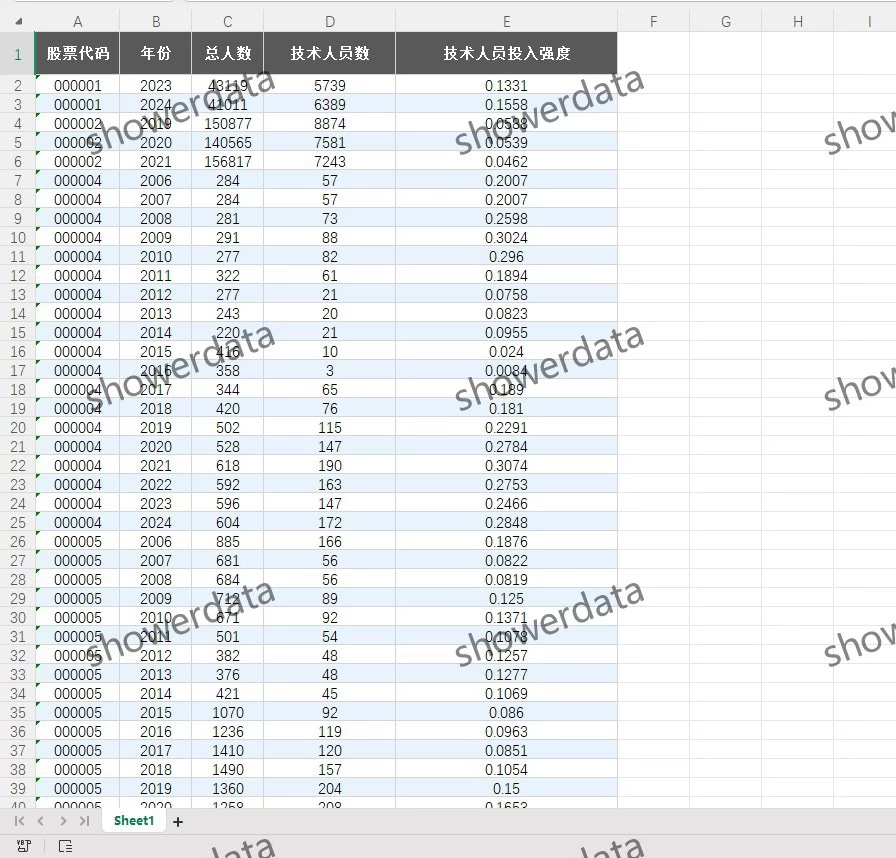
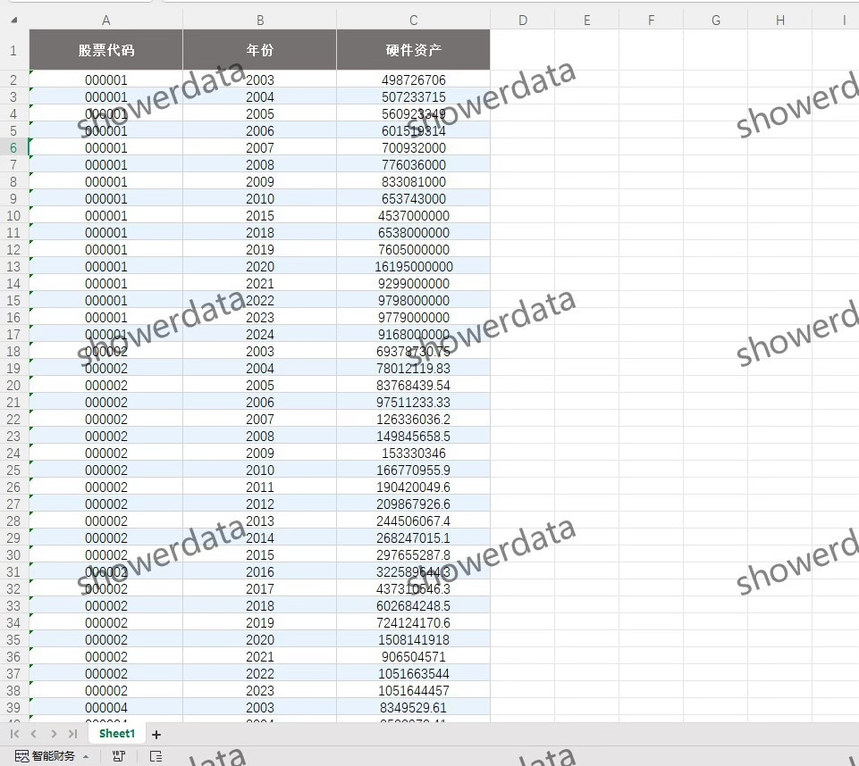
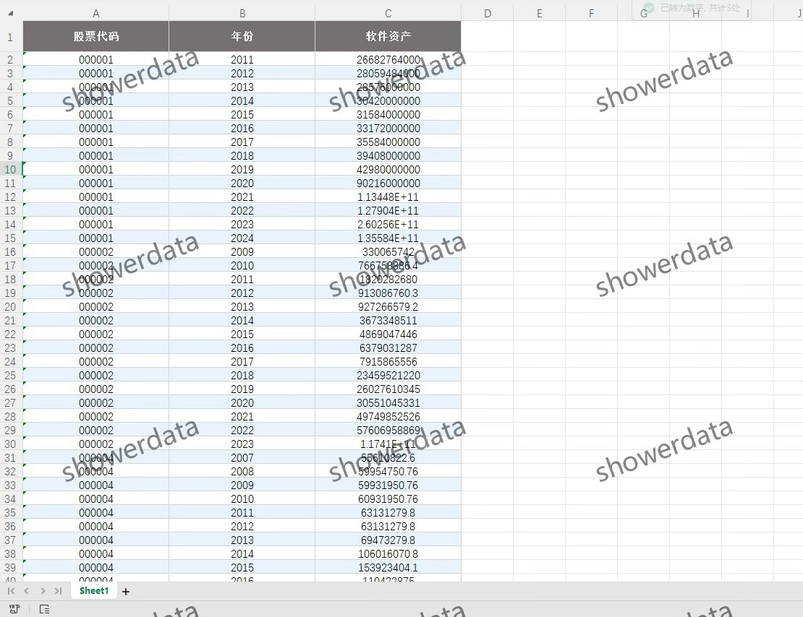
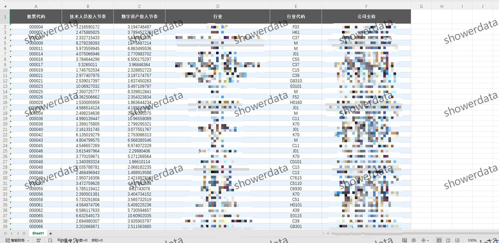

## Body

（2007-2024）上市公司-数字技术投入节奏程度

一、数据介绍
（1）数据详情：见下方图片，拍前请看清楚！已完整展示说明，请确定好是不是自己需要的再拍下！发货后任何理由不退不换！ 
（2）数据名称：上市公司-数字技术投入节奏程度
（3）样本范围：A鼓尚视公司，2k+样本量
（4）时间范围：2007-2024 
（5）数据格式：excel 
（6）数据内容：四张excel表格

二、数据结果指标如图所示 

三、计算方法如图所示

四、参考文献如图所示

## Images

Here is a pay link on Stripe ( https://buy.stripe.com/3cs8yP7sY87d0vu9AB ). Please contact me lonlonago@foxmail.com after funding $89, and I will send you a complete data files , thank you!

